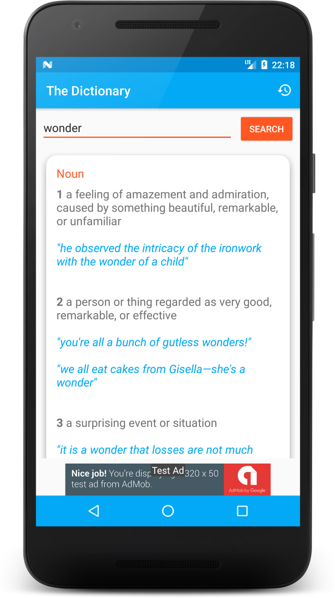

## The Dictionary

Capstone Project for Android Nanodegree by Udacity.

#### Description

* Search words and expressions in English Dictionary with more than 350 000 entries powered by Oxford Api.

* Search history will be recorded for easy access.

* Home widget is provided with latest ten search history entries.

### Configuration

In order to run this project, you need to get an **app id** and **app key** from [**Oxford Dictionaries**](https://developer.oxforddictionaries.com/).

You need to set your appid and app key in your `gradle.properties` file as following:

    appId = your-app-id
    appKey = your-app-key

You also need create a Firebase Project and download google-services.json
to use Firebase Admob and Analytics

### Screenshots

Search 1             |  Search 2 |  Search 3
:-------------------------:|:-------------------------:|:-------------------------:
  |   |  

History           |  App Widget
:-------------------------:|:-------------------------:
  |  

### Credits

#### Libraries

   [Retrofit](https://github.com/square/retrofit)

   [ViewModel and LiveData](https://developer.android.com/topic/libraries/architecture/adding-components.html)

   [Room](https://developer.android.com/topic/libraries/architecture/adding-components.html)

   [Materialish Progress](https://github.com/pnikosis/materialish-progress)

   [Butterknife](https://github.com/JakeWharton/butterknife)

   [Stetho](https://github.com/facebook/stetho)

   [RecyclerViewEnhanced](https://github.com/nikhilpanju/RecyclerViewEnhanced)

   [Firebase Admob](https://firebase.google.com/docs/android/setup)

   [Firebase Analytics](https://firebase.google.com/docs/android/setup)

#### Icons

App icon => Book Dictionary by Thomas Helbig from the Noun Project
https://thenounproject.com/search/?q=dictionary&i=676111

## License

Copyright 2018 Figen Güngör

Licensed under the Apache License, Version 2.0 (the "License");
you may not use this file except in compliance with the License.
You may obtain a copy of the License at

    http://www.apache.org/licenses/LICENSE-2.0

Unless required by applicable law or agreed to in writing, software
distributed under the License is distributed on an "AS IS" BASIS,
WITHOUT WARRANTIES OR CONDITIONS OF ANY KIND, either express or implied.
See the License for the specific language governing permissions and
limitations under the License.